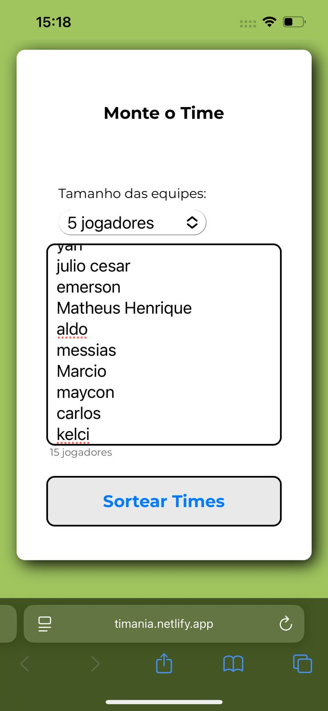

<h1 align="center" style="font-weight: bold;">Timania ⚽️</h1>

 
    
    
    
    

 

<h2 id="started">📌 Sobre o projeto:</h2>

Um Organizador de equipes de futebol simples e reponsivo, usando puramente HTML5, CSS3 e JavaScript. Além disso, este app possui uma interface intuitiva e de fácil uso para que seus usuários formem equipes de maneira rápida e sem dor de cabeça. 
 

<h2 id="started">💻 Funcionalidade:</h2>

    

    

<h2 id="started">🚀 Acessando o site:</h2>

Comece a sortear suas equipes de futebol pelo link: 
https://timania.netlify.app/

