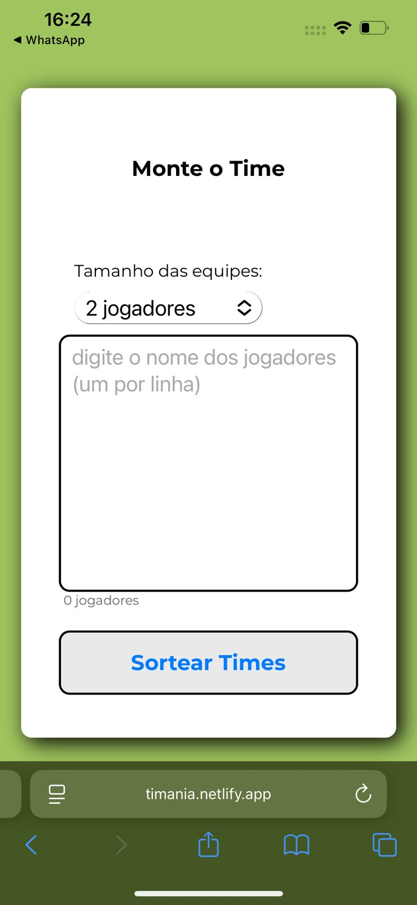
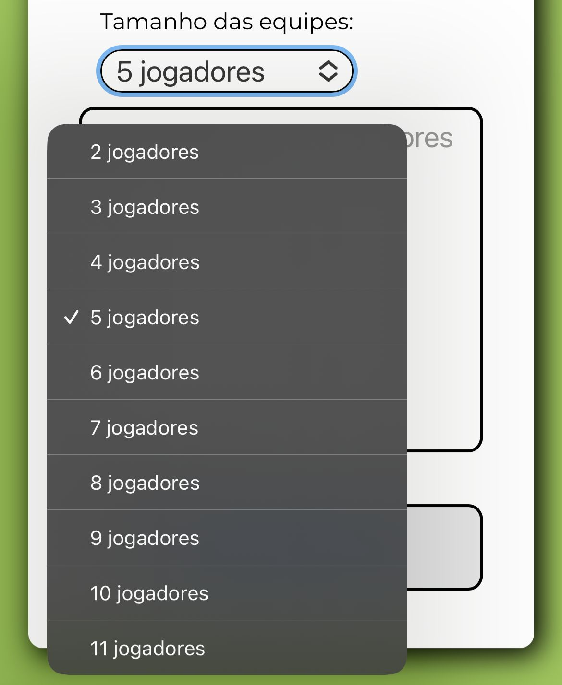
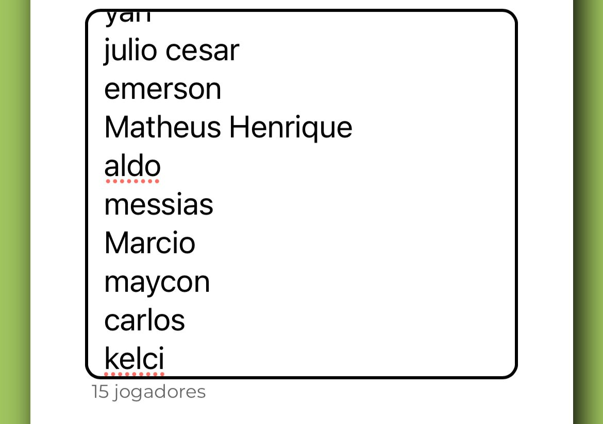
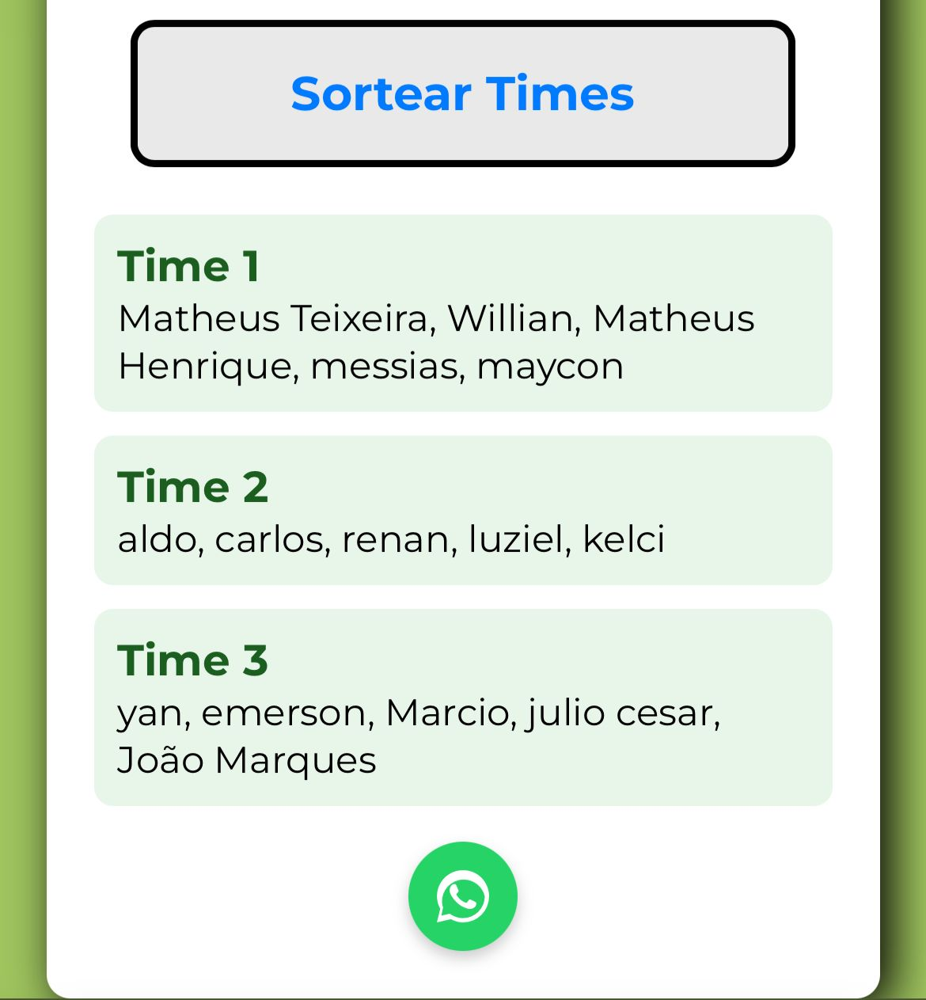
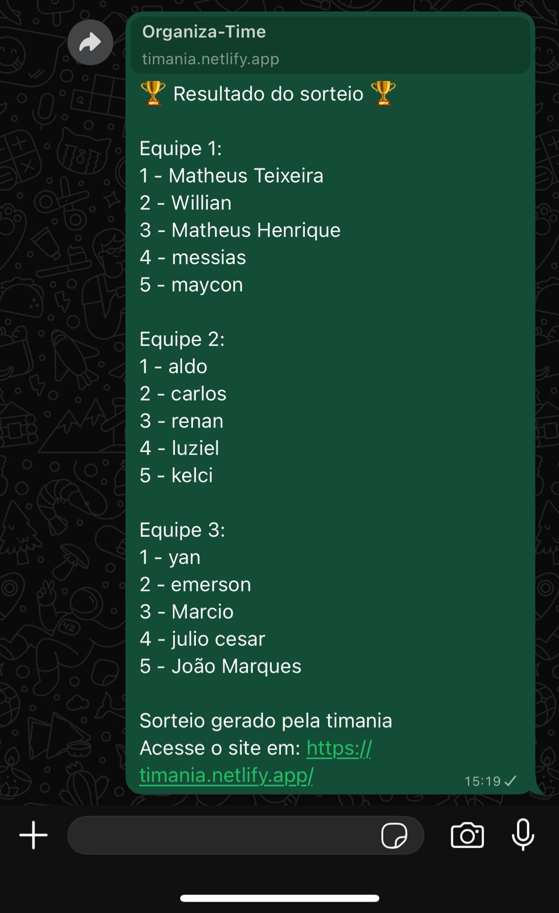

<h1 align="center" style="font-weight: bold;">Timania ⚽️</h1>

 
    
    
    
    

 

<h2 id="started">📌 Sobre o projeto:</h2>

Um Organizador de equipes de futebol simples e reponsivo, usando puramente HTML5, CSS3 e JavaScript. Além disso, este app possui uma interface intuitiva e de fácil uso para que seus usuários formem equipes de maneira rápida e sem dor de cabeça. 
 

<h2 id="started">💻 Funcionalidade:</h2>

1. PRIMEIRO PASSO: 
    Ao acessar o site, você verá uma landing page simples e responsiva, com todas as funcionalidades de fácil acesso:
     

    

2. QUANTIDADE DE JOGADORES: 
    Comece selecionando a quantidade de jogadores que terá em cada equipe. Você pode selecionar um máximo de 11 jogadores em cada equipe.
     

    

3. ADICIONE SUA LISTA DE JOGADORES: 
    Adicone um jogador por linha na área de texto. Linhas vazias serão desconsideradas e não serão contabilizadas no contador de jogadores.
     

    

4. SORTEIE SUAS EQUIPES: 
    Ao clicar em SORTEAR, uma nova área surgirá com suas equipes formadas. cada equipe estará organizada em um balão verde para que fique fácil a identificação. Ao final do sorteio, um botão com link pro whatsapp estará disponível.
     

    

5. COMPARTILHAR COM WHATSAPP: 
    Ao clicar em compartilhar, o usuário será redirecionado para o aplicativo do whatsapp com uma mensagem ja formatada contendo todas as equipes do sorteio. Tudo isso feito de forma fácil e eficaz, para que todos os integrantes se localizem rapidamente.
     

    

<h2 id="started">🚀 Acessando o site:</h2>

Comece a sortear suas equipes de futebol pelo link: 
https://timania.netlify.app/

